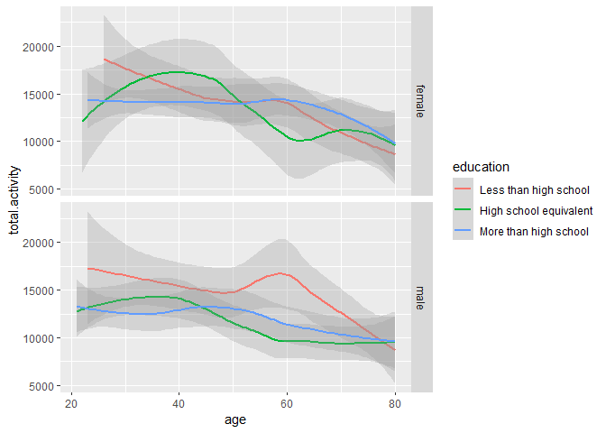

## R Markdown

This is an R Markdown document. Markdown is a simple formatting syntax
for authoring HTML, PDF, and MS Word documents. For more details on
using R Markdown see <http://rmarkdown.rstudio.com>.

When you click the **Knit** button a document will be generated that
includes both content as well as the output of any embedded R code
chunks within the document. You can embed an R code chunk like this:

``` r
summary(cars)
```

    ##      speed           dist       
    ##  Min.   : 4.0   Min.   :  2.00  
    ##  1st Qu.:12.0   1st Qu.: 26.00  
    ##  Median :15.0   Median : 36.00  
    ##  Mean   :15.4   Mean   : 42.98  
    ##  3rd Qu.:19.0   3rd Qu.: 56.00  
    ##  Max.   :25.0   Max.   :120.00

## Including Plots

You can also embed plots, for example:


Note that the `echo = FALSE` parameter was added to the code chunk to
prevent printing of the R code that generated the plot.

Problem 2

``` r
library(dplyr)

devtools::install_github("p8105/p8105.datasets")
```

    ## Skipping install of 'p8105.datasets' from a github remote, the SHA1 (412759e3) has not changed since last install.
    ##   Use `force = TRUE` to force installation

``` r
library(p8105.datasets)

library(ggplot2)

data("brfss_smart2010")
```

``` r
names(brfss_smart2010)
```

    ##  [1] "Year"                       "Locationabbr"              
    ##  [3] "Locationdesc"               "Class"                     
    ##  [5] "Topic"                      "Question"                  
    ##  [7] "Response"                   "Sample_Size"               
    ##  [9] "Data_value"                 "Confidence_limit_Low"      
    ## [11] "Confidence_limit_High"      "Display_order"             
    ## [13] "Data_value_unit"            "Data_value_type"           
    ## [15] "Data_Value_Footnote_Symbol" "Data_Value_Footnote"       
    ## [17] "DataSource"                 "ClassId"                   
    ## [19] "TopicId"                    "LocationID"                
    ## [21] "QuestionID"                 "RESPID"                    
    ## [23] "GeoLocation"

``` r
brfss_smart2010.x <- brfss_smart2010 %>%
                     filter(Topic == "Overall Health") %>%
                     mutate(Response = factor(Response, levels = c("Poor", "Fair", "Good", "Very Good", "Excellent")))

table(brfss_smart2010.x$Response)
```

    ## 
    ##      Poor      Fair      Good Very Good Excellent 
    ##      2125      2125      2125         0      2125

``` r
brfss_smart2010.x %>% filter(Year == 2002) %>%
                      group_by(Locationabbr) %>%
                      summarise(x = n()) %>%
                      filter(x >= 7)
```

    ## # A tibble: 36 × 2
    ##    Locationabbr     x
    ##    <chr>        <int>
    ##  1 AZ              10
    ##  2 CO              20
    ##  3 CT              35
    ##  4 DE              15
    ##  5 FL              35
    ##  6 GA              15
    ##  7 HI              20
    ##  8 ID              10
    ##  9 IL              15
    ## 10 IN              10
    ## # ℹ 26 more rows

``` r
brfss_smart2010.x1 <- brfss_smart2010.x %>%
                      filter(Response == "Excellent") %>%
                      select(Year, Locationabbr, Data_value) %>%
                      group_by(Year, Locationabbr) %>%
                      summarise(mean = mean(Data_value))
```

    ## `summarise()` has grouped output by 'Year'. You can override using the `.groups`
    ## argument.

``` r
ggplot(brfss_smart2010.x1, aes(x = Year, y = mean, group =  Locationabbr, color = Locationabbr )) +
  geom_line() +
  ylab("Mean of Data Value")
```

    ## Warning: Removed 3 rows containing missing values (`geom_line()`).


``` r
brfss_smart2010.x2 <- brfss_smart2010.x %>%
                      filter(Year %in% c(2006, 2010)) %>%
                      group_by(Locationabbr) %>%
                      summarise(x = n()) %>%
                      filter(x >= 7)


brfss_smart2010.x2 <- brfss_smart2010.x %>%
  filter(Year %in% c(2006, 2010)) %>%
  filter(Locationabbr == "NY")


ggplot(brfss_smart2010.x2, aes(x=Data_value, fill = Response)) +   
       geom_density(alpha=.3) +
       facet_grid(Year ~ .)            
```


Problem 3

``` r
library(readr)

nhanes_accel <- read_csv("C:/hw3/nhanes_accel (1).csv")
```

    ## Rows: 250 Columns: 1441
    ## ── Column specification ─────────────────────────────────────────────────────────────────
    ## Delimiter: ","
    ## dbl (1441): SEQN, min1, min2, min3, min4, min5, min6, min7, min8, min9, min10, min11,...
    ## 
    ## ℹ Use `spec()` to retrieve the full column specification for this data.
    ## ℹ Specify the column types or set `show_col_types = FALSE` to quiet this message.

``` r
nhanes_covar <- read_csv("C:/hw3/nhanes_covar (2).csv", skip = 4)
```

    ## Rows: 250 Columns: 5
    ## ── Column specification ─────────────────────────────────────────────────────────────────
    ## Delimiter: ","
    ## dbl (5): SEQN, sex, age, BMI, education
    ## 
    ## ℹ Use `spec()` to retrieve the full column specification for this data.
    ## ℹ Specify the column types or set `show_col_types = FALSE` to quiet this message.

``` r
library(tidyverse)


data <- nhanes_covar %>%
  left_join(nhanes_accel) %>%
  filter(age >= 21) %>%
  drop_na(sex, age, BMI, education) %>%
  mutate(sex = ifelse(sex == 1, "male", "female"),
    education = case_when(education == 1 ~ "Less than high school",
                          education == 2 ~ "High school equivalent",
                          education == 3 ~ "More than high school"),
   education = factor(education, levels = c("Less than high school",
                                         "High school equivalent",
                                         "More than high school")))
```

    ## Joining with `by = join_by(SEQN)`

``` r
table(data$sex, data$education)                                        
```

    ##         
    ##          Less than high school High school equivalent More than high school
    ##   female                    28                     23                    59
    ##   male                      27                     35                    56

``` r
ggplot(data, aes(x=age, fill = education)) +   
       geom_density(alpha=.3) +
       facet_grid(sex ~ .) 
```


``` r
ggplot(data, aes(x=age, fill = sex)) +   
       geom_density(alpha=.3) +
       facet_grid(education ~ .)
```


``` r
data1 <- data %>%
  mutate(total.activity = rowSums(across(min1:min1440), na.rm = T))

ggplot(data1, aes(x = age, y = total.activity, color = education)) +
       geom_smooth(alpha = .3) + facet_grid(sex ~ .)
```

    ## `geom_smooth()` using method = 'loess' and formula = 'y ~ x'



The density plot reveals differences between male and female in three
education groups:

Less than High School: The density plot shows that there is no
significant difference between the distributions of male and female in
this education group. High School Equivalent: In this category, the
density plot suggests a noticeable difference in the distribution of
male and female, which have a relative opposite distribution.

More than High School: The density plot indicates that in this study,
there are more female at an early age, around 30, who show a higher
tendency to attend the program.

In totally activity graph:

As age increases, the amount of exercise for male and female with three
different educational backgrounds continues to decrease. There was a
significant difference in the amount of exercise between the three
groups of people when they were young, but as they grew older, the gap
continued to narrow. In the end, the amount of exercise among the three
groups was almost the same. Among male, “Lesson than high” has the
highest total activity from young to old. Among female, the total
activity of “less than high school” decreased much faster than that of
male. The change range of “High school equlvalent” is larger than that
of male.

``` r
data2 <- data %>%
  pivot_longer(cols = starts_with("min"),
  names_to = "time",
  values_to = "value",
  values_drop_na = TRUE
  )

data2$timex <- as.numeric(gsub("min", "", data2$time))

ggplot(data2, aes(x = timex, y = value, color = sex)) +
  geom_smooth(alpha = .3) + facet_grid(education ~ .)
```

    ## `geom_smooth()` using method = 'gam' and formula = 'y ~ s(x, bs = "cs")'


The last plot shows the activity levels of male and female in each
education level along with their wearing time of 24 hours:

Less than High School: No clear difference can be observed between the
two genders in this category.

High School Equivalent: female tend to be more active than male after
around 8 hours, and this difference lasts for another 8 hours.

More than High School: female tend to be more active than male after
around 8 hours, and this difference persists until almost the end of the
measurement.
